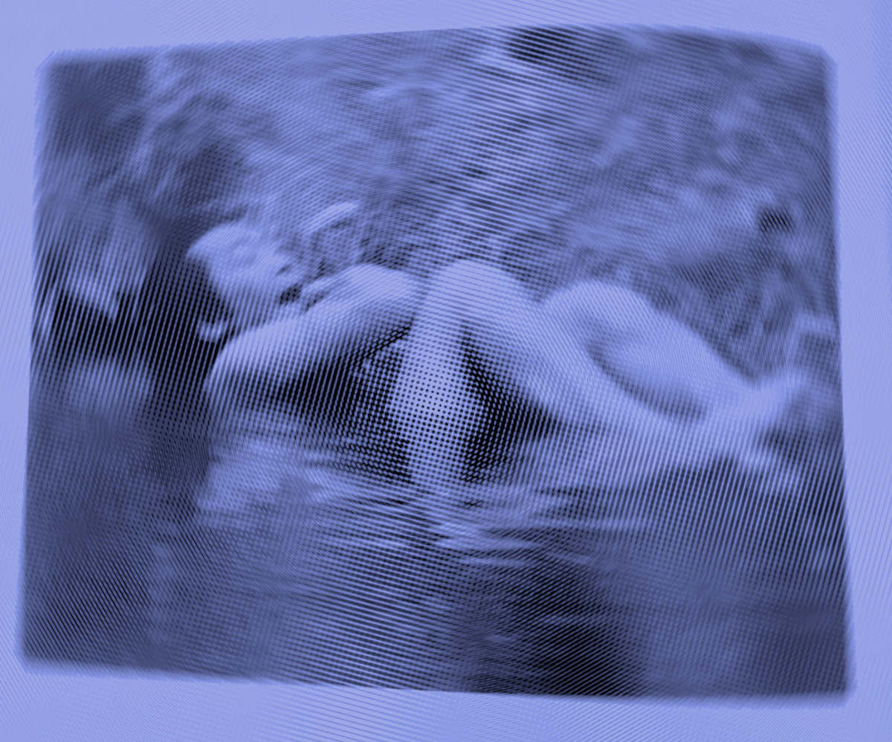
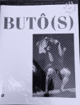
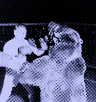

Un homme est couché dans un ruisseau, recroquevillé. Sa tête est en contact avec la berge, déposée sur une pierre, bouche béante. Il a les yeux entrouverts sans fixité. Il flotte ou repose sur le fond. Il est suspendu. La photo est en noir et blanc, je la redécouvre. Notre rencontre remonte à quelques années : je feuilletais  négligemment [un livre sur le butō]{.mark-link} à la médiathèque de Bordeaux, que je fréquentais alors assidûment, quand une image a littéralement arrêté mon geste d'égrainage.
Elle n'a cessé depuis de m'habiter. Pour le jeune danseur que j'étais, habitué aux parquets souples, aux espaces organisés où des élèves suivent en silence et en rang les consignes d'un professeur, cette pensée de l'apprentissage était fascinante, et exotique, bref : incompréhensible. 
Mais l'image, elle, s'est installée et a fait, comme un vieux bois, son travail.

::: {.column-margin}

**RÉFÉRENCE · BUTO**

[{width=150}](https://www.cnrseditions.fr/catalogue/arts-et-essais-litteraires/butos/)

Odette Aslan & Béatrice Picon-Vallin (dir.), *Butōs*, CNRS Éditions, coll. "Arts du spectacle".

[→ CNRS Éditions](https://www.cnrseditions.fr/catalogue/arts-et-essais-litteraires/butos/)

:::
# Pourquoi le geste ?

Min Tanaka a passé de nombreuses années à s'entraîner dans les ruisseaux en se laissant porter, former et déformer par les eaux glacées du Japon. Il s'agit bien, pour Min Tanaka, d'un entraînement et d'un apprentissage. Passer de longues heures à écouter l'écoulement de l'eau et l'accompagner dans un dessaisissement, non pas du corps, mais du mouvement volontaire. Ce n'est pas un abandon. C'est une écoute ouverte, [un dessaisissement actif où se tisse précisément une danse]{.mark-concept}.

::: {.column-margin}

**CONCEPT · PRÉ-MOUVEMENT**

L'écart entre le mouvement visible et la toile tonique du sujet. Introduit ici, développé en profondeur dans le chapitre 2.

[→ Ch. 2, "Le pré-mouvement comme anticipation habitée"](https://lagouttiere-crypto.github.io/pedagogie-perceptive/06-Chapitre%202%20-%20L'attention%20comme%20accordage.html#le-pré-mouvement-comme-anticipation-habitée)

:::

Cette inversion du regard est le premier geste de ce livre. Ce que nous appelons habituellement mouvement, le déplacement observable, mesurable, reproductible n'est que la partie émergée. Il y a autre chose qui colore, oriente, donne sens au mouvement. Min Tanaka danse sous le mouvement visible. Il soustrait pour laisser paraître un geste. Il offre une minuscule chance au sens de devenir visible.

La question que pose cette image est aussi celle que pose toute séance de Technique Alexander : qu'est-ce que nous cherchons, exactement, quand nous pratiquons ? Nous pouvons venir avec des réponses très précises : une douleur chronique, une rigidité, une qualité de présence entrevue un jour. Nous venons souvent avec des convictions sur le corps et le mouvement. L'apprentissage va souvent consister à défaire un certain nombre de ces idées reçues, non pour les remplacer par d'autres, mais pour offrir une expérience différente. Et cette expérience passe en premier lieu par une compréhension différente de ce qu'est un geste.

C'est pourquoi ce livre commence par là. Pas par le corps, pas par la posture, ni par l'habitude, l'inhibition, l'appréciation sensorielle ou le contrôle primaire, concepts par lesquels on décrit traditionnellement le travail de la Technique Alexander, mais par le geste.

Celui-ci traverse notre langage avec une innocente familiarité. Nous l'évoquons : un beau geste, en faire un, ou l'esquisser. Cette familiarité masque une ambiguïté fondamentale : [le geste ne recouvre jamais le seul mouvement du corps]{.mark-concept}.

::: {.column-margin}

**CONCEPT · MOUVEMENT / GESTE**

La distinction fondamentale de Godard : le mouvement est biomécanique, le geste est relationnel. Cette distinction traverse tout le livre.

[→ Ch. 2, "Haptomai : le toucher en voix moyenne"](https://lagouttiere-crypto.github.io/pedagogie-perceptive/06-Chapitre%202%20-%20L'attention%20comme%20accordage.html#haptomai-le-toucher-en-voix-moyenne)

:::

Hubert Godard propose cette distinction éclairante [@godard2012] : le mouvement relève du déplacement biomécanique observable, trajectoire d'un membre dans l'espace, activation de groupes musculaires, cinématique articulaire. Une machine peut produire un mouvement : le bras d'un robot industriel qui saisit une pièce sur une chaîne de montage effectue un mouvement parfaitement reproductible, mesurable, analysable en termes de forces et de trajectoires. Le geste, lui, appartient à un autre ordre de réalité. Hubert Godard le définit comme ce qui s'inscrit dans l'écart entre le mouvement visible et la toile de fond tonique du sujet, ce qu'il nomme le pré-mouvement. [l'expressivité du geste humain, que la machine ne possède pas]{.mark-link}. Nous ne faisons jamais deux fois le même geste, parce que le geste est adresse, il porte toujours en lui un tiers qui l'empêche de se refermer. Et c'est cette ouverture même, cette instabilité constitutive, qui en permet paradoxalement la lecture. 

::: {.column-margin} 

**RÉSONANCE · MASSUMI** 

{width=160} 

> *L'excès stylistique du jeu correspond à une puissance de variation. La forme du geste se déforme sous la pression de l'enthousiasme du corps qui le propulse.* Brian Massumi, *Ce que les bêtes nous apprennent de la politique*, p. 30. 

::: {.margin-tooltip}

[→ Lire la note complète](https://garden-gester.fr/massumi-variation) 
[*Ouvre la note sur Garden Gester*]{.tooltip-text} 

::: 

:::

Nous ne faisons jamais deux fois le même geste, parce que le geste est adresse, il porte toujours en lui un tiers qui l'empêche de se refermer. Et c'est cette ouverture même, cette instabilité constitutive, qui en permet paradoxalement la lecture.

Saisir un verre d'eau, en tant que mouvement, c'est une coordination main-bras-épaule, une préhension palmaire, un ajustement de la force de serrage, du rapport gravitaire. Trinquer avec ce même verre lors d'une soirée d'anniversaire, c'est accomplir un geste. Trinquer, c'est faire signe à l'autre, s'inscrire dans un rituel de convivialité, manifester une intention sociale, habiter par des gestes, un monde rythmé et tissé de liens. Le mouvement biomécanique est identique ou presque, lever le verre, le déplacer vers celui de l'autre. [Mais le geste configure un monde]{.mark-concept} : un monde où existe la célébration, la reconnaissance mutuelle, le lien.

::: {.column-margin}

**CONCEPT · FAIRE PARAÎTRE UN MONDE**

Emma Bigé : le geste n'agit pas sur un monde déjà donné, il le fait advenir. Concept central repris dans chaque geste fondamental.

[→ Ch. 2, "L'attention comme accordage"](https://lagouttiere-crypto.github.io/pedagogie-perceptive/06-Chapitre%202%20-%20L'attention%20comme%20accordage.html#lattention-comme-accordage)

:::

Le geste ne se contente pas d'agir sur un objet pré-donné dans un espace neutre. Il fait paraître un monde [@bige2023]. Cette formulation, empruntée à Emma Bigé, n'est pas métaphorique. Elle désigne quelque chose de précis sur le plan phénoménologique : avant que je me mette à écouter quelqu'un, il n'y a pas encore de parole, il y a des sons. C'est le geste d'écouter qui fait advenir la parole comme parole, qui constitue le silence comme porteur de sens, qui ouvre un monde où quelqu'un dit quelque chose à quelqu'un d'autre. De la même manière, le geste devient geste quand il est porté et reconnu comme adresse par un autre (présent ou absent). C'est cette même présence-absence qui organise et rythme la façon dont j'écris sur mon clavier et qui contribue à organiser ma pensée comme adresse.

Bien qu'usé, le geste de pointer du doigt est peut-être l'exemple le plus nu. En tant que mouvement, c'est une extension de l'index, une stabilisation du poignet, une rotation de l'épaule. Mais pointer est un geste : il fait émerger un objet dans le champ perceptif partagé, il dirige l'attention de l'autre, il instaure une référence commune. Ce simple geste ressaisit l'oiseau qui fraie dans le ciel et l'ami à mes côtés, il reconfigure après sa réalisation, la scène en son entier. Le geste fonctionne comme le marqueur du verbe en allemand, rejeté en fin de phrase : c'est seulement une fois accompli que le sens de toute la séquence se révèle rétroactivement, que la relation entre les protagonistes et le monde se trouve nouée dans et par le geste.

Emma Bigé formule cela de manière saisissante : [le geste nomme l'indissociabilité de l'agir, de l'être et du sentir]{.mark-concept} [@bige_note]. Cette phrase désigne une unité fondamentale que notre langage habituel tend à fragmenter. Lorsque je touche quelque chose, je ne fais pas qu'agir sur un objet, éprouver une sensation tactile, être présent à moi-même dans cet acte, ces trois dimensions sont rigoureusement indissociables. Le geste est précisément le nom de cette indissociabilité.

::: {.column-margin}

**CONCEPT · MÉDIALITÉ**

Bigé : indissociabilité agir/être/sentir. La voix moyenne du geste. Concept central repris dans chaque geste fondamental du livre.

[→ Ch. 2, "Haptomai"](https://lagouttiere-crypto.github.io/pedagogie-perceptive/06-Chapitre%202%20-%20L'attention%20comme%20accordage.html#haptomai-le-toucher-en-voix-moyenne)

:::

C'est ce qui rend la distinction mouvement/geste non pas théorique, mais pratiquement décisive pour quiconque travaille avec la Technique Alexander. Lorsque le professeur pose ses mains sur l'élève, il ne touche pas des vertèbres cervicales ni des muscles. Il touche une personne, c'est-à-dire qu'il entre dans un monde relationnel où le toucher est proposition, invitation, écoute. Ce toucher-là et le toucher d'un mécanicien qui manipule des pièces ne mobilisent pas les mêmes récepteurs tactiles, la même organisation gravitaire, ne déploient pas le même imaginaire. Ils font littéralement advenir des mondes différents et par là-même des usages différents de ces mondes.

Mais pourquoi le geste est-il le lieu de cette indissociabilité ? Pourquoi pas le mouvement, l'action, l'acte ? La réponse est dans ce que le geste porte d'archéologie et c'est ici que l'enquête doit aller plus avant. Car, avant d'apprendre quoi que ce soit, avant même que quelque chose comme un "je" ne se constitue, [il y avait une indiscernabilité]{.mark-concept}.

::: {.column-margin}

**CONCEPT · INDISCERNABILITÉ**

La couche pré-objectale où je bouge / je suis bougé / le monde bouge sont indémêlables. Fondement de l'archéologie du geste.

[→ Ch. 2, "L'accordage comme fondement postural"](https://lagouttiere-crypto.github.io/pedagogie-perceptive/06-Chapitre%202%20-%20L'attention%20comme%20accordage.html#laccordage-comme-fondement-postural)

:::

Nous en éprouvons encore l'écho parfois. Ce moment où, assis dans un train immobile, le départ du train voisin nous dérobe brièvement notre propre immobilité, et avec elle ce sol et cette cohérence spatiale si patiemment négociés.

Cette indiscernabilité n'est pas une hypothèse abstraite. Ce que les sciences du développement décrivent comme la phase pré-objectale [@bullinger2004] a un visage concret : celui du nourrisson couché sur le dos qui agite ses jambes. Voit-il ses jambes bouger, ses jambes ? Ou "voit-il" des "objets-jambes" agiter ce bain visuel où rien n'est encore objet ? N'est-ce pas justement cela pour lui que voir ? Sent-il qu'il fait bouger quoi ? Ses jambes ? Ou sent-il que là-bas, ça bouge et agite en même temps, l'espace du mobile au-dessus, d'un lui à qui un autre parle, rythmant ainsi ses mouvements et un monde qui lentement s'ordonnance ? Il y a bien un "je", mais pas au sens où l'adulte le vit — un je embryonnaire, un je naissant, mais sans la prétention d'un agent souverain. Il ne distingue pas encore la source interne de la source externe du mouvement, l'agir de l'être agi, le moi du monde. Je bouge. Je suis bougé. Le monde bouge. Ces trois formulations décrivent le même événement, indémêlable.

Ce n'est pas une phase révolue, un stade primitif qu'on aurait dépassé. C'est une couche qui reste là, sous les habitudes constituées, sous le contrôle appris, sous la représentation de soi comme agent séparé du monde qu'il habite. Et ce que les praticiens somatiques cherchent, souvent sans le formuler ainsi, c'est précisément l'accès à cette couche. Non pas pour y régresser, mais pour la retrouver comme ressource. Parce que c'est dans ce nouage qu'un geste nouveau a la chance de pouvoir émerger.

Dans ce flux originel, dans [cet entrelacs que Merleau-Ponty nomme la chair]{.mark-concept} [@merleauponty1968 ; @merleauponty1945], un seul invariant traverse absolument tout : la gravité.

::: {.column-margin}

**CONCEPT · CHAIR**

Merleau-Ponty : ni corps-objet ni conscience pure, mais l'étoffe commune du percevant et du perçu. Fondement phénoménologique du livre.

[→ Ch. 2, "La matière qui informe"](https://lagouttiere-crypto.github.io/pedagogie-perceptive/06-Chapitre%202%20-%20L'attention%20comme%20accordage.html#la-matière-qui-informe)

:::

C'est cette dernière qui fait de nous des êtres humains-humus, venus de la terre et toujours à elle tenus. Qu'on bouge ou soit bougé, qu'on agisse ou subisse, elle est là. Elle organise. Elle ne peut être attribuée ni au dedans ni au dehors, elle est toujours dans le pli. C'est cette constance absolue qui en fait l'organisateur primordial de la différenciation. La gravité fonctionne comme un invariant structurant : non perceptible en elle-même, elle organise depuis l'intérieur l'ensemble des relations qui s'y nouent. [Ce que nous percevons, ce sont toujours ses effets différentiels]{.mark-concept}, les variations toniques, les ajustements posturaux, les déséquilibres et rééquilibrations qui signalent sa présence sans jamais l'exposer directement.

::: {.column-margin}

**CONCEPT · GRAVITÉ**

Invariant absolu qui traverse tout le livre. Organisateur primordial de la différenciation, fond invisible de toute perception.

*À venir — Ch. 3 : Peser*

:::

C'est autour de cet axe que quelque chose comme un "je" commence à s'extraire du flux. Non pas comme une substance qui se découvrirait préformée, mais comme un pattern stable qui émerge progressivement des coordinations répétées [^varela-enaction]{.mark-concept} [@varela1991 ; @thompson2007], coordinations où gravitaire, affectif, perceptif et relationnel ne sont jamais trois choses séparées qui s'additionnent, mais trois aspects d'un seul événement de la chair. Se redresser pour voir quelqu'un, c'est simultanément négocier avec la gravité, exprimer un accordage affectif, s'ouvrir au geste. Le "je" émerge dans ce triple mouvement, pas avant lui.

::: {.column-margin} 

CONCEPT · ÉNACTION 

Varela, Thompson & Rosch : le "je" n'est pas une substance préformée mais un pattern émergent de coordinations sensori-motrices répétées. La cognition comme co-émergence organisme-monde. → Carte 2-3, "L'énaction : co-émergence, le sens qui advient" en écriture.

:::

Ce que ce développement éclaire rétroactivement, c'est la nature de ce que nous cherchons en venant à une séance. Nous ne cherchons pas à apprendre comment bouger correctement mais à retrouver un accès à ce niveau où organisme et monde ne sont pas encore antagonistes. Où le sol n'est pas un obstacle mais un appui, où la gravité n'est pas une contrainte mais une relation, où le mouvement n'est pas un effet de la volonté mais une émergence de la chair. Ce long déploiement pour dire quelque chose que nous éprouvons soudainement : le soulagement heureux de se déposer sur le sol et de se sentir porté, organisé pour et dans la relation. La joie anecdotique d'une poitrine qui retrouve de son volume en trouvant à siéger. 

Et la raison pour laquelle ce livre commence par le geste, plutôt que par le corps, la posture, la biomécanique, c'est que le geste est précisément le lieu où cette couche originaire reste accessible, palpitante. Le mouvement peut se décrire sans sujet : cinématique, forces, trajectoires. Mais le geste, jamais. Le geste est toujours transitif. Il va toujours vers quelque chose, vers quelqu'un, vers un monde. Il configure une relation. Et c'est dans la relation, entre soi et le sol, entre soi et l'autre, entre soi et la gravité, que la transformation est possible.

Min Tanaka immergé dans le ruisseau explore la couche où les trois formulations restent indémêlées : je bouge, je suis bougé, l'eau me bouge. Et dans cet espace, quelque chose se danse parce qu'il a cessé de séparer ce qui ne l'était pas au départ.

La Technique Alexander, vue depuis cette archéologie, n'est pas une technique pour améliorer la posture. C'est une pratique qui apprend à retrouver, geste par geste, cet espace de l'indiscernabilité créatrice. Non pas en défaisant le "je", on ne peut pas et ce n'est pas le but, mais en le rendant moins rigide, moins contrôleur, plus poreux à ce qui émerge quand on cesse de "tout diriger".

Les chapitres qui suivent déploient chacun [un geste fondamental de cette pratique]{.mark-link}. Non pas des techniques à maîtriser, mais des enquêtes à mener. Enquêtes sur la façon dont toucher, peser, regarder, inhiber et s'orienter peuvent rouvrir, chaque fois, l'espace entre le mouvement visible et la toile de fond tonique qui le porte. L'espace où, pendant un instant, on ne sait plus tout à fait qui bouge et où quelque chose peut commencer, re-commencer.

::: {.column-margin}

**STRUCTURE · GESTES FONDAMENTAUX**

Les cinq enquêtes du livre : toucher · peser · regarder · inhiber · s'orienter.

*À venir — Ch. 3 : Toucher · Ch. 4 : Peser · Ch. 5 : Regarder · Ch. 6 : Inhiber · Ch. 7 : S'orienter*

:::