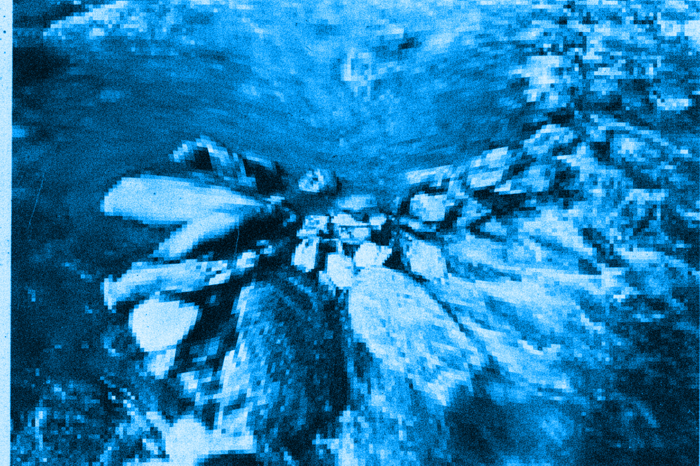

Un homme est couché dans un ruisseau, recroquevillé. Sa tête est en contact avec la berge, déposée sur une pierre. Il a les yeux entrouverts sans fixité. Il flotte ou repose sur le fond. Il est suspendu. La photo est en noir et blanc, je la redécouvre.

  

# **Pourquoi le geste ?**

Min Tanaka a passé de nombreuses années à s'entraîner dans les ruisseaux en se laissant porter, former et déformer par les eaux glacées du Japon. Il s'agit bien, pour Min Tanaka, d'un entraînement et d'un apprentissage. Passer de longues heures à écouter l'écoulement de l'eau et l'accompagner dans un dessaisissement, non pas du corps, mais du mouvement volontaire. Ce n'est pas un abandon. C'est une écoute ouverte, un dessaisissement actif où se tisse précisément une danse. Pour le spectateur : une quasi-immobilité, un corps ballotté, abandonné au courant. Pour Min Tanaka : un apprentissage en cours.

Cette inversion du regard est le premier geste de ce livre. Ce que nous appelons habituellement mouvement, le déplacement observable, mesurable, reproductible n'est que la partie émergée. Il y a autre chose qui colore, oriente, donne sens au mouvement. Min Tanaka danse sous le mouvement visible. Il soustrait pour laisser paraître un geste. Il offre une minuscule chance au sens de devenir visible.

La question que pose cette image est aussi celle que pose toute séance de Technique Alexander : qu'est-ce que nous cherchons, exactement, quand nous pratiquons ? Nous pouvons venir avec des réponses très précises : une douleur chronique, une rigidité, une qualité de présence entrevue un jour. Nous venons souvent avec des convictions sur le corps et le mouvement. L'apprentissage va souvent consister à défaire un certain nombre de ces idées reçues, non pour les remplacer par d'autres, mais pour offrir une expérience différente. Et cette expérience passe en premier lieu par une compréhension différente de ce qu'est un geste.

C'est pourquoi ce livre commence par là. Pas par le corps, pas par la posture, ni par l’habitude, l’inhibition, l’appréciation sensorielle ou le contrôle primaire… mais par le geste.

Le geste traverse notre langage avec une trompeuse familiarité. Nous parlons de faire un geste, d'un beau geste, d'esquisser un geste. Cette familiarité masque une ambiguïté fondamentale : le geste ne recouvre jamais le seul mouvement du corps. Lorsque je saisis un verre d'eau, ai-je effectué un mouvement ou accompli un geste ? La distinction peut sembler bien fine et comme toute chose fragile, accessoire, mais elle ouvre une brèche conceptuelle où se joue toute la singularité de ce que la Technique Alexander explore, et que nous cherchons à déplier.

Hubert Godard propose cette distinction éclairante ; le mouvement relève du déplacement biomécanique observable, trajectoire d'un membre dans l'espace, activation de groupes musculaires, cinématique articulaire. Une machine peut produire un mouvement : le bras d'un robot industriel qui saisit une pièce sur une chaîne de montage effectue un mouvement parfaitement reproductible, mesurable, analysable en termes de forces et de trajectoires. Le geste, lui, appartient à un autre ordre de réalité. Hubert Godard le définit comme ce qui s'inscrit dans l'écart entre le mouvement visible et la toile de fond tonique du sujet, ce qu'il nomme le pré-mouvement. C'est dans cet écart, dans cette coloration, que réside l'expressivité du geste humain, dont est démunie la machine. Nous ne faisons jamais deux fois le même geste et cette variabilité, est paradoxalement ce qui en permet la lecture. 

Saisir un verre d'eau, en tant que mouvement, c'est une coordination main-bras-épaule, une préhension palmaire, un ajustement de la force de serrage, du rapport graivitaire. Trinquer avec ce même verre lors d'une soirée d'anniversaire, c'est accomplir un geste. Trinquer, c'est faire signe à l'autre, s'inscrire dans un rituel de convivialité, manifester une intention sociale, habiter par des gestes, un monde rythmé et tissé de liens. Le mouvement biomécanique est identique ou presque, lever le verre, le déplacer vers celui de l'autre. Mais le geste configure un monde : un monde où existe la célébration, la reconnaissance mutuelle, le lien.

Le geste ne se contente pas d'agir sur un objet pré-donné dans un espace neutre. Il fait paraître un monde. Cette formulation, empruntée à Emma Bigé, n'est pas métaphorique. Elle désigne quelque chose de précis sur le plan phénoménologique : avant que je me mette à écouter quelqu'un, il n'y a pas encore de parole, il y a des sons. C'est le geste d'écouter qui fait advenir la parole comme parole, qui constitue le silence comme porteur de sens, qui ouvre un monde où quelqu'un dit quelque chose à quelqu'un d’autre. De la même manière, le geste devient geste quand il est porté et reconnu comme adresse par un autre ( présent ou absent ). C’est cette même présence-absence qui organise et rythme la façon dont j’écris sur mon clavier et qui contribue à organiser ma pensée comme adresse. 

Pointer du doigt est peut-être l'exemple le plus saisissant. En tant que mouvement, c'est une extension de l'index, une stabilisation du poignet, une rotation de l'épaule. Mais pointer est un geste : il fait émerger un objet dans le champ perceptif partagé, il dirige l'attention de l'autre, il instaure une référence commune. Ce simple geste ressaisit l'oiseau qui fraie dans le ciel et l'ami à mes côtés, il reconfigure après sa réalisation, la scène en son entier. Il est comme le marqueur du verbe en allemand, placé en fin de phrase. Ce n'est qu'une fois le geste accompli, que le sens de toute la séquence se révèle rétroactivement, que la relation entre les protagonistes et le monde se trouve nouée dans et par le geste. 

Emma Bigé formule cela de manière saisissante : le geste nomme l'indissociabilité de l'agir, de l'être et du sentir. Cette phrase désigne une unité fondamentale que notre langage habituel tend à fragmenter. Lorsque je touche quelque chose, je ne fais pas qu'agir sur un objet, éprouver une sensation tactile, être présent à moi-même dans cet acte, ces trois dimensions sont rigoureusement indissociables. Le geste est précisément le nom de cette indissociabilité.

C'est ce qui rend la distinction mouvement/geste non pas théorique, mais pratiquement décisive pour quiconque travaille avec la Technique Alexander. Lorsque le professeur pose ses mains sur l'élève, il ne touche pas des vertèbres cervicales ni des muscles. Il touche une personne — c'est-à-dire qu'il entre dans un monde relationnel où le toucher est proposition, invitation, écoute. Ce toucher-là et le toucher d'un mécanicien qui manipule des pièces ne mobilisent pas les mêmes récepteurs tactiles, la même organisation gravitaire, ne déploie pas le même imaginaire. Ils font littéralement advenir des mondes différents et par là-même des usages différents de ces mondes.

Mais pourquoi le geste est-il le lieu de cette indissociabilité ? Pourquoi pas le mouvement, l'action, l'acte ? La réponse est dans ce que le geste porte d'archéologie et c'est ici que l'enquête doit aller plus avant. Car, avant d'apprendre quoi que ce soit, avant même que quelque chose comme un "je" ne se constitue, il y avait une indiscernabilité. Nous en éprouvons encore le malaise parfois, quand assis confortablement dans un train, le train voisin nous emporte tout entier dans son sillage, nous dépossédant un instant de notre sol et de notre cohérence spatiale chèrement acquise. 

Un nourrisson couché sur le dos, agite ses jambes : voit-il ses jambes bouger, ou voit-il des « objets-jambes » qui se déplacent dans son champ visuel ? Sent-il qu'il fait bouger ses jambes, ou sent-il que ses jambes bougent, comme le mobile au-dessus de lui ? Il y a bien un « je », mais pas au sens où l'adulte le vit – un je embryonnaire, un je naissant, mais sans la prétention d'un agent souverain. Il ne distingue pas encore la source interne de la source externe du mouvement, l'agir de l'être agi, le moi du monde. Je bouge. Je suis bougé. Le monde bouge. Ces trois formulations décrivent le même événement, indémêlable.

Ce n'est pas une phase révolue, un stade primitif qu'on aurait dépassé. C'est une couche qui reste là, sous les habitudes constituées, sous le contrôle appris, sous la représentation de soi comme agent séparé du monde qu'il habite. Et ce que les praticiens somatiques cherchent, souvent sans le formuler ainsi, c'est précisément l'accès à cette couche. Non pas pour y régresser, mais pour la retrouver comme ressource. Parce que c’est dans ce nouage qu’un geste nouveau à la chance de pouvoir émerger. 

Dans ce flux originel, dans cet entrelacs que Merleau-Ponty nomme la chair, un seul invariant traverse absolument tout : la gravité . C’est cette dernière qui fait de nous des être humains-humus, venant de la terre comme berceau et fond indissociable de notre attachement.  Qu'on bouge ou soit bougé, qu'on agisse ou subisse, elle est là. Elle organise. Elle ne peut être attribuée ni au dedans ni au dehors, elle est toujours dans le pli. C'est cette constance absolue qui en fait l'organisateur primordial de la différenciation. Comme le fond blanc d'une page permet de voir les lettres noires sans jamais être vu lui-même, la gravité permet de distinguer ce qui varie — les mouvements, les objets, les autres — sans jamais être sentie isolément, toujours à travers des variations toniques, posturales, relationnelles.

C'est autour de cet axe que quelque chose comme un "je" commence à s'extraire du flux. Non pas comme une substance qui se découvrirait préformée, mais comme un pattern stable qui émerge progressivement des coordinations répétées, coordinations où gravitaire, affectif, perceptif et relationnel ne sont jamais trois choses séparées qui s'additionnent, mais trois aspects d'un seul événement de la chair. Se redresser pour voir quelqu'un, c'est simultanément négocier avec la gravité, exprimer un accordage affectif, s’ouvrir au geste. Le "je" émerge dans ce triple mouvement, pas avant lui.

Ce que ce développement éclaire rétroactivement, c'est la nature de ce qu'on cherche en venant à une séance. On ne cherche pas à apprendre comment bouger correctement. On cherche à retrouver accès à ce niveau où organisme et monde ne sont pas encore antagonistes — où le sol n'est pas un obstacle mais un appui, où la gravité n'est pas une contrainte mais une relation, où le mouvement n'est pas un effet de la volonté mais une émergence de la chair.

Et la raison pour laquelle ce livre commence par le geste — plutôt que par le corps, la posture, la biomécanique — c'est que le geste est précisément le lieu où cette couche originaire reste accessible, palpitante. Le mouvement peut se décrire sans sujet : cinématique, forces, trajectoires. Mais le geste, jamais. Le geste est toujours transitif. Il va toujours vers quelque chose, vers quelqu'un, vers un monde. Il configure une relation. Et c'est dans la relation — entre soi et le sol, entre soi et l'autre, entre soi et la gravité — que la transformation est possible.

Min Tanaka immergé dans le ruisseau, explore la couche où les trois formulations restent indémêlées : je bouge, je suis bougé, l'eau me bouge. Et dans cet espace, quelque chose se danse parce qu'il a cessé de séparer ce qui ne l'était pas au départ.

La Technique Alexander, vue depuis cette archéologie, n'est pas une technique pour améliorer la posture. C'est une pratique qui apprend à retrouver, geste par geste, cet espace de l'indiscernabilité créatrice. Non pas en défaisant le "je », on ne peut pas et ce n'est pas le but, mais en le rendant moins rigide, moins contrôleur, plus poreux à ce qui émerge quand on cesse de « tout diriger ». 

Les chapitres qui suivent déploient chacun un geste fondamental de cette pratique. Non pas des techniques à maîtriser, mais des enquêtes à mener. Enquêtes sur la façon dont toucher, peser, regarder, inhiber et s'orienter peuvent rouvrir, chaque fois, l'espace entre le mouvement visible et la toile de fond tonique qui le porte. L'espace où, pendant un instant, on ne sait plus tout à fait qui bouge et où quelque chose peut commencer, re-commencer.