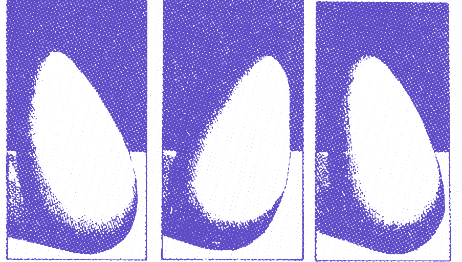

# Première exploration

Trouvez un espace confortable où vous asseoir, déposez le livre pour libérer vos mains de leur fonction de portage. Libérez votre torse de la fonction de portage à laquelle vos mains l'avaient temporairement assujetti.

Prenez un temps, même court, pour libérer votre regard du livre. Redonnez-lui la liberté de s'abandonner quelque temps aux contours des objets qui peuplent la pièce. Épousez les volumes, les textures. Palpez du regard, soupesez du regard le monde qui vous enveloppe. 

Vous voici de retour ici. Posez délicatement la paume de votre main droite sur la paume de votre main gauche, ou la paume gauche sur la droite. Palpez, explorez cette dernière, observez, goûtez, participez tactilement et affectivement à cette exploration. Observez comment cette perception se tisse grâce à une motricité exploratoire. Soupesez les gestes qui accompagnent et rythment votre mélodie du sentir. Vous en percevez le rythme, ou encore le rythme est enveloppe à votre perception. Voyez comme cette exploration se nourrit, s'alimente d'images multiples. Images anatomiques complexes ou enfantines. Les deux cartes, celles du sentir et celle de ce bestiaire anatomique, ne se superposent jamais tout à fait. Regardez à présent vos mains dessinant cet étrange ballet. Observez comme la carte du visible et du tactile, bien que tissant intimement cette expérience, ne se recouvrent que partiellement. Elles se chevauchent, se rencontrent pour donner profondeur à l'expérience.

Quand vous le souhaitez, et par goût uniquement de l'exploration, vous pouvez inverser ces mondes. Brusquement, votre main agissante devient la main explorée. Ou encore, votre regard tout à l'heure qui explorait activement la surface de vos mains par de multiples saccades devient maintenant la surface accueillante et réfléchissante, surface qui s'ouvre au tactile et en accueille la profondeur.

Savourez comme chaque élément, accordé au suivant, ne se maintient que dans le mouvement de l'exploration. Comme cette exploration pourrait être à chaque instant déviée vers des sujets annexes. Voyez comme l'entreprise n'existe que par la continuité du sentir qui cherche à s'affiner par sa propre exploration. Chaque découverte, perception, événement se donne comme une sorte de détroit entre des horizons extérieurs et des horizons intérieurs toujours béants.

Laissez doucement cet espace de tissage s'ouvrir. Reposez-vous pleinement dans cet entrelacement des sens.

Buvez un verre d'eau et faites quelques pas.