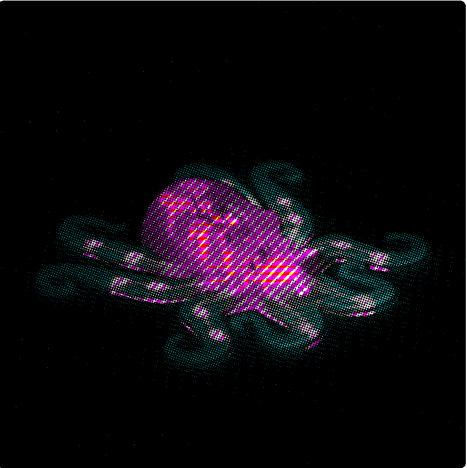

# Chapitre 2 - L'attention comme accordage

*Dès que vous pensez à ce que vous voulez accomplir, vous cessez de prêter attention à ce par quoi vous l'accomplissez.* F.M. Alexander

Ce chapitre reprend le fil, là où le premier l'avait laissé, suspendu. Un corps dans un ruisseau, porté, déplacé, presque immobile. Min Tanaka y dansait sous le mouvement visible. Ou plutôt : quelque chose se dansait là, dans une zone d'indiscernabilité. Qui bouge ?

Cette suspension n'est pas fortuite. Elle touche à l'un des partages les plus puissants de la modernité : celui qui oppose l'activité à la passivité, l'initiative à la réception, le sujet qui agit au monde sur lequel il agit. Nous avons appris à nous recevoir comme les auteurs de nos gestes, les centres de décision de nos mouvements, les responsables de ce que notre corps accomplit. Cette figure du sujet souverain ne relève pas seulement de la philosophie ou du droit. Elle informe silencieusement nos façons de sentir, de nous tenir, de toucher, d'apprendre.

Mais si le geste est, comme nous le proposons, transitif, s'il est le fait d'une relation première qui donne naissance à ses éléments constitutifs, alors une question s'impose d'elle-même : qui, ou quoi, l'accueille ?

Notre hypothèse tient en un mot : l'attention.

Une attention qui, telle que nous allons tenter de la cerner ici, ne se définit pas comme une propriété cérébrale, d'un sujet-îlot, mais comme une dynamique relationnelle qui fait advenir le monde qu'elle traverse. Une dynamique d'accordage par laquelle un corps, un monde, parfois un autre, deviennent mutuellement sensibles. L'attention ne vient pas après coup éclairer une situation déjà là ; elle participe à sa constitution. Elle ne sélectionne pas seulement dans un monde donné : elle laisse paraître.

Il s'agira de montrer qu'avant d'être capture ou focalisation, l'attention est peut-être d'abord une manière de se laisser former par ce que l'on rencontre sans cesser pour autant d'y prendre part. Une manière d'entrer en rapport.

> *Les rois ne touchent pas aux portes. Ils ne connaissent pas ce bonheur : pousser devant soi avec douceur ou rudesse l'un de ces grands panneaux familiers, se retourner vers lui pour le remettre en place, tenir dans ses bras une porte.*
>
> *… Le bonheur d'empoigner au ventre par son nœud de porcelaine l'un de ces hauts obstacles d'une pièce ; ce corps à corps rapide par lequel un instant la marche retenue, l'œil s'ouvre et le corps tout entier s'accommode à son nouvel appartement.*
>
> Les plaisirs de la porte, Francis Ponge [@ponge1942]

## Haptomai : le toucher en voix moyenne

Min Tanaka dans le ruisseau nous a laissés sur un seuil. Celui de l'indiscernabilité : je bouge, je suis bougé, l'eau me bouge, trois formulations pour un seul événement, indémêlable, celui d'un geste : toucher.

Ponge le sait. Tenir dans ses bras une porte, voilà un toucher qui ne va pas de soi à la porte mais ouvre un monde. Ici, le corps tout entier est ouvert par le geste à son nouvel appartement. Pour le dire encore autrement, le sujet est présenté à lui-même par le geste qu'il accomplit, non pas action sur un objet inerte, mais rencontre, négociation, moment de corps à corps où je suis changé en touchant, présenté en moi-même à ce nouvel environnement auquel m'ouvre le geste de franchir.

Les rois, eux, ne touchent pas, selon Ponge, ils font toucher, ils commandent, imposent. Im-ponere : poser sur, placer dessus, mouvement à sens unique, de Lui vers l'autre, sans retour. Voilà pourquoi ils ne connaissent pas ce bonheur, celui d'habiter par le geste un monde qu'ils sont censés, avant tout autre geste, ordonner.

Ce bonheur porte un nom en grec. Le linguiste Émile Benveniste, dans un article remarquable intitulé *L'actif et le moyen dans le verbe* [@benveniste1950], a mis au jour une diathèse verbale que le français a perdue et que le grec ancien possédait : la voix moyenne. En français, on choisit entre l'actif, je touche, mouvement qui va de moi vers l'objet, et le passif, je suis touché, où je ne suis plus sujet mais objet. Mais le grec connaissait une troisième dynamique, qui ne se laisse pas réduire à ces deux-là.

Dans la voix moyenne, le sujet est à la fois agent et site de son action. Ce que je fais est aussi ce par quoi j'arrive. Benveniste donne des exemples qui méritent qu'on les laisse résonner : naître, mourir, décider, voler, épouser un mouvement. Dans chacun de ces actes, quelque chose échappe au partage actif/passif. Naître : personne d'autre que moi ne pourrait naître à ma place, et pourtant je ne décide pas de naître, le moi est au bout de la naissance, son terme, pas son point de départ. Épouser un mouvement : c'est bien moi qui saisis la vague quand je nage, et c'est bien la vague qui me porte, me fait, me déplace.

Le verbe grec pour toucher est précisément de ce genre : haptomai, avec la désinence -omai qui marque le moyen. Pas hapto, mettre en contact, geste purement transitif, mais haptomai : je touche en étant touché, je vais vers l'objet en me laissant affecter par lui. La structure grammaticale dit quelque chose que notre langue ne peut pas dire d'un seul mot : le mouvement est double dans un seul acte.

Emma Bigé, à partir de Benveniste, propose que le geste, tout geste, est de l'ordre du moyen [@bige2023]. Ni pure action volontaire sur un monde-objet, ni pure réception passive. Le geste nous fait en même temps que nous le faisons. Ce qu'elle nomme la voie médiane.

Si l'on en croit certains commentateurs, Marjory Barlow se souvenait qu'Alexander lui aurait confié avoir commencé à prendre les gens par frustration devant leur incapacité à suivre ses instructions verbales. Le geste inaugural du toucher, si singulier à la Technique Alexander, serait donc arrivé tard dans la genèse de la pratique, et presque par accident. Tentant de transmettre verbalement des orientations à un élève récalcitrant, Alexander aurait fini par poser les mains pour montrer, et percevant par là même le mauvais usage qu'il s'imposait à lui-même, aurait inhibé l'intention de modifier. Ce toucher désarmé, soustrait à tout projet instrumental, aurait alors produit la réorganisation gravitaire qu'il tentait d'imposer l'instant d'avant à son élève.

Cette anecdote, qui tient lieu de mythologie fondatrice, a engendré une éthique du toucher non interventionniste. Celui d'un défaire, d'un ne-pas-faire, d'une soustraction : devenir l'hôte de sa propre affectation plutôt que producteur de geste. Haptomai redécouvert par accident, dans un moment de capitulation féconde. Ce qu'Alexander découvre par accident, Benveniste l'avait inscrit dans la grammaire : il existe un mode du toucher qui ne se commande pas, qui advient quand le vouloir-toucher se défait.

Gilles Estran, formateur de Technique Alexander, en s'appuyant sur la distinction tracée par Hubert Godard [@godard2012], développe ainsi ce basculement. Premier mode : commande volontaire, projet instrumental. Même avec douceur, même avec gentillesse, ce mode impose, im-ponere, aller simple. Second mode : les mains sont en réception totale, il n'y a aucun projet instrumental, une contagion s'opère. Estran le décrit dans sa propre pratique comme un passage : d'un toucher qui se focalise vers l'autre, produisant une stagnation qu'il nomme non-vie, à un toucher où il se laisse toucher en même temps qu'il touche, un aller-retour continu qui stimule la circulation et le changement. Haptomai, exactement.

La conséquence de ce basculement est saisissante. Dans ce second mode, la personne commence à s'organiser avant même que le mouvement ne se donne à voir. Le pré-mouvement a déjà transformé le champ du couplage. Ce n'est plus un professeur qui agit sur un élève. C'est une organisation qui émerge entre eux, dont aucun n'est seul l'auteur, mais dont chacun est le siège d'une transformation qui ne ressemble à aucune autre.

Estran ajoute ceci, qui éclaire ce que la voie médiane n'est pas : un fil d'Ariane peut se tendre, la conscience pondérale. Elle est la sécurité de non-confusion. La voie médiane n'est pas la fusion. Ce n'est pas se dissoudre dans l'autre, ni s'y perdre. C'est précisément parce que le praticien reste présent à son propre poids, à son propre sol, à sa propre organisation, qu'il peut se laisser affecter sans se perdre. On ne peut se laisser vraiment toucher que si on ne se confond pas.

Ponge le savait aussi. Se retourner vers la porte pour la remettre en place, le sujet reste là, présent, distinct. C'est parce qu'il reste lui-même qu'il peut tenir dans ses bras quelque chose d'autre que lui. La voie médiane n'efface pas le sujet. Elle le décentre, le rend poreux, disponible, ouvert à ce qu'il fait et à ce qui le fait : à un usage de soi.

Ce que le toucher en voix moyenne révèle, c'est quelque chose que Hubert Godard formule avec une économie saisissante : toucher, c'est tomber, même de quelques grammes. Pas de contact sans abandon partiel de soi vers ce qu'on touche. Pas de perception sans engagement moteur dans ce qu'on perçoit.

## L'accordage comme fondement postural

Mais cette leçon déborde le cadre de la pratique alexandrienne. Elle désigne quelque chose de plus fondamental : la voix moyenne n'est pas une modalité particulière du geste, un raffinement accessible aux seuls praticiens. C'est la structure originaire de notre rapport au monde. Nous n'avons pas appris à toucher en voix moyenne. Nous sommes nés dedans.

Godard formule ce paradoxe avec une précision qui mérite qu'on s'y arrête [@godard2012] : les muscles qui ont pour fonction, à l'âge adulte, de gérer la gravité sont les mêmes muscles qui, chez le nourrisson, ont pour fonction de gérer la relation à l'autre. Autrement dit, le dispositif musculaire et neurologique qui nous permet de faire avec la gravité a pour premier usage non pas de nous permettre de nous tenir debout, ce que ne fait pas le nourrisson avant longtemps, mais de nous exprimer. L'appareil moteur qui nous servira debout à composer avec la gravité est d'abord entraîné par une toute autre négociation : celle de l'accordage affectif du nourrisson avec ses proches. Il y a ainsi indissociabilité entre notre façon propre de négocier avec la gravité et notre expressivité. Le fond postural qui porte nos gestes est d'abord un fond relationnel.

Ce que la clinique d'Ajuriaguerra confirme depuis un autre angle [@ajuriaguerra1970]. L'essentiel de l'activité du nourrisson est posturale, à ceci près qu'il n'y a pas encore de posture à tenir, puisque l'enfant repose en permanence, soit sur le sol, soit dans les bras des parents. C'est précisément là qu'intervient l'hypothèse du psychiatre : la fonction de ces premières réactions toniques est relationnelle. L'activité tonico-posturale est la fonction de communication essentielle pour le jeune enfant, fonction d'échange par l'intermédiaire de laquelle l'enfant donne et reçoit. Ce mode de communication s'exprime au mieux en parlant de contagion tonique : l'enfant partage avec les parents son état affectif en leur présentant des variations toniques auxquelles ceux-ci s'accordent, et non seulement réagissent. L'état d'alarme du nourrisson est partagé par les parents comme son état d'apaisement. Ce partage est ce qui est recherché par le nourrisson et en fonction duquel ses réactions seront progressivement adaptées aux situations de l'environnement. La personnalité du nourrisson se façonne en même temps qu'elle façonne et met en question l'environnement qui l'accueille. Le nourrisson n'est pas, du fait de son immobilité, un être passivement informable : c'est parce qu'il met à l'épreuve, dans la relation tonique avec le parent, les situations auxquelles il est confronté, qu'il peut se les approprier.

Jan Patočka nommait ce rapport premier au monde le proto-mouvement de l'existence [@patocka1988], mouvement placé sous le signe de l'affect plutôt que de l'action. Dans ce proto-mouvement, l'homme est par tout son être tributaire de l'autre homme dans sa fonction de protecteur, créateur de sécurité et de chaleur vitale, donateur d'unité, d'adhérence et d'attachement. Et le phénoménologue tchèque ne s'y trompait pas en référant ce proto-mouvement à la Terre comme son lieu d'ancrage : c'est dans le rapport gravitaire que s'entretient cette première relation, à la fois parce qu'elle suppose l'enracinement du parent qui, pour accueillir l'enfant, doit se ménager une place dans le monde, et parce qu'elle met en jeu les mêmes mécanismes qui deviendront les colorations posturales des mouvements une fois l'enfant debout.

C'est ce que la séance Alexander rejoue, geste par geste. Quand Estran décrit ce second mode où quelque chose commence à s'organiser avant même que le mouvement ne se donne à voir, il décrit la réouverture d'un dialogue tonique que l'habitude avait refermé. Non pas un apprentissage nouveau, mais le retour à une structure qui était là avant toute technique, avant toute intention, et que le toucher en voix moyenne a le pouvoir, parfois, de réveiller.

Et c'est ici qu'une question s'impose : comment ce dialogue tonique est-il possible ? Par quel canal le tonus de l'un traverse-t-il l'autre ? Par quels moyens le corps perçoit-il, ce qui le tient et ce qu'il tient ? La réponse est dans la matière même du corps.

## La matière qui informe

Cornell University, Ithaca, État de New York, 1963. Richard Held et Alan Hein installent dans une pièce plongée dans l'obscurité un dispositif circulaire, un carrousel [@held1963]. Deux chatons y sont placés, élevés depuis la naissance sans jamais avoir été exposés à la lumière. Le premier est libre de ses mouvements : il marche, pivote, entraîne par ses déplacements le mécanisme auquel il est relié. Le second est suspendu dans une nacelle solidaire du même mécanisme : il reçoit exactement les mêmes stimulations visuelles que le premier, les mêmes rotations, les mêmes variations de lumière et d'ombre, le même environnement. Mais il est porté, transporté, passif. Ses pattes ne touchent pas le sol. Il ne produit aucun mouvement propre.

Après plusieurs semaines, les deux chatons sont exposés à la lumière pour la première fois. Le premier se comporte normalement : il évite les obstacles, perçoit la profondeur, ajuste ses déplacements à l'environnement. Le second se cogne aux parois, trébuche, échoue à estimer les distances, pose la patte dans le vide là où il y a une marche. Il voit, au sens physiologique du terme, ses yeux fonctionnent, la lumière atteint sa rétine, les signaux nerveux remontent jusqu'au cortex visuel. Mais il ne perçoit pas.

Cette expérience, publiée en 1963 dans la revue Science, a traversé les décennies comme un séisme tranquile. Elle n'a pas fait scandale immédiatement, elle était trop précise, trop bien construite pour être facilement récusée. Mais elle a lentement, irréversiblement, déplacé quelque chose dans la façon dont les sciences cognitives pensaient la perception.

Jusqu'alors, le modèle dominant était celui de la réception : le monde envoie des signaux, l'organisme les reçoit, le cerveau les traite. La perception était affaire de capteurs et de traitement de l'information, un organisme passif face à un monde qui s'imprime sur lui.

Ce que Held et Hein montraient était d'une simplicité révolutionnaire : deux organismes soumis aux mêmes stimulations visuelles, dans le même environnement, pendant la même durée, produisent des résultats radicalement différents selon qu'ils sont actifs ou passifs. L'information visuelle est identique. Ce qui diffère, c'est le mouvement. Et c'est ce mouvement qui fait toute la différence entre voir et percevoir.

La conclusion s'imposait, inconfortable pour beaucoup : percevoir n'est pas recevoir. C'est agir. Ou plus précisément, c'est dans l'entrelacs de l'action et de la réception que quelque chose comme la perception émerge. Le chaton passif ne manque pas d'informations visuelles. Il manque du couplage entre ce qu'il voit et ce qu'il fait, ce retour en boucle entre le mouvement et ses conséquences sensorielles, sans lequel aucun invariant ne peut s'extraire du flux, aucune profondeur ne peut se constituer, aucun monde ne peut paraître.

Ce que Held et Hein mettaient ainsi en évidence rejoignait, depuis le laboratoire et depuis l'expérimentation animale, ce que la phénoménologie avait tenté de formuler depuis un autre bord : nous ne nous promenons pas dans un monde déjà là, que nous recevrions passivement. Nous le construisons par le mouvement. Actif et passif ne désignent pas deux états distincts mais les deux pôles d'un même vecteur dynamique. Et cela vaut jusqu'au cœur de ce que nous croyons être la simple réception du monde.

Mais cette leçon, aussi décisive soit-elle, reste à la surface de quelque chose de plus profond encore. Car si percevoir c'est bouger, il faut se demander ce qui, dans le corps lui-même, rend possible ce couplage entre mouvement et perception. La réponse n'est pas dans le cerveau. Elle est dans la matière.

Une confirmation inattendue est venue d'un domaine qu'on n'aurait pas soupçonné : la robotique. Ce n'est pas la première fois que la technologie oblige la science à revoir ses représentations du vivant. La paléontologie en a fait l'expérience de façon saisissante : c'est en cherchant à reconstituer le mouvement des dinosaures pour le cinéma, en travaillant avec des modèles cinétiques pour animer des créatures disparues, que les chercheurs ont été contraints de repenser l'anatomie même de ces animaux. Les contraintes de la locomotion, la mécanique du mouvement, ont redessiné des squelettes que les fossiles seuls n'auraient jamais permis de comprendre ainsi.

La robotique contemporaine a produit quelque chose d'analogue pour notre compréhension de la perception. Et elle l'a fait en se heurtant à un problème d'économie d'énergie. Les robots de la première génération, ceux qui incarnent encore aujourd'hui l'imaginaire dominant, parfaitement articulés, capables de sauter, de courir, de faire des saltos, consomment des quantités d'énergie considérables pour calculer en permanence leur équilibre, anticiper chaque déplacement, commander chaque articulation depuis un centre de traitement. Leur intelligence est hiérarchique, descendante, coûteuse, même si les modèles les plus récents ont commencé à intégrer des mécanismes passifs, des ressorts, des matériaux qui absorbent et redistribuent les forces sans calcul explicite. C'est précisément cette intuition qui a ouvert une autre voie, plus discrète, plus radicale dans ses implications : et si la structure physique du robot pouvait elle-même résoudre une partie des problèmes, sans commande explicite, par la seule vertu de sa matière ?

L'Octobot est entièrement fabriqué en silicone souple, imprimé en trois dimensions, et propulsé par une réaction chimique simple : la décomposition du peroxyde d'hydrogène en gaz, canalisée par un réseau de microcanaux moulés dans la matière même du corps. Ce réseau, par sa géométrie, sa résistance, son élasticité, produit une séquence de mouvements alternés qui font ondoyer les tentacules. Aucun cerveau ne commande. La structure pense à sa place.

Ce robot sans cerveau a été présenté en 2016 dans la revue Nature par une équipe des laboratoires de Harvard [@octobot2016]. Ce que cette expérience révèle a un nom dans la robotique contemporaine : la computation morphologique. L'intelligence n'est pas dans le centre de traitement, elle est distribuée dans la forme, dans la matière, dans les propriétés mécaniques du corps lui-même. La structure physique du robot n'est pas un support passif que le logiciel viendrait animer : elle est elle-même une forme de calcul, une façon de résoudre des problèmes sans les poser explicitement.

Cette idée prolonge quelque chose qu'avait pressenti Rodney Brooks dès les années 1980, avec ce qu'il nommait l'architecture de subsomption [@brooks1986]. Subsumere, en latin : prendre dessous, inclure, prendre le relais sans remplacer. Brooks proposait que l'intelligence d'un robot ne soit pas hiérarchique, descendant d'un centre vers la périphérie, mais distribuée en couches, chacune fonctionnelle en elle-même. Les couches supérieures ne remplacent pas les inférieures : elles peuvent les inhiber, les moduler, infléchir leur réponse selon le contexte, mais elles ne les éteignent jamais. La couche qui évite les obstacles continue d'être active quand la couche qui choisit une direction prend le relais. Rien n'est jamais suspendu à une décision centrale. C'est un système d'inhibitions sélectives, non de commandements.

Ce que Brooks intuitionne depuis la robotique, l'oreille interne le réalise depuis toujours dans la matière vivante. Au plus profond de l'os temporal, logé dans un labyrinthe osseux de la taille d'un petit pois, se trouve l'organe vestibulaire. Trois canaux semi-circulaires, orientés selon les trois plans de l'espace, et deux chambres, l'utricule et le saccule. L'ensemble baigne dans un liquide, l'endolymphe, dont une propriété physique va se révéler décisive : il est légèrement visqueux.

Ce détail, qui pourrait sembler accessoire, est en réalité le principe même du fonctionnement de l'organe. Lorsque la tête se déplace, les parois osseuses des canaux bougent avec elle. Mais le liquide, en raison de sa viscosité, résiste. Il accuse un retard. Et c'est précisément cet écart, cette différence de vitesse entre la paroi qui a déjà bougé et le liquide qui n'a pas encore tout à fait suivi, qui déforme les cellules ciliées et produit le signal nerveux. Sans résistance, pas d'écart. Sans écart, pas d'information. La viscosité n'est pas un obstacle à la perception : elle en est la condition.

Mais ce que capte cet écart n'est pas n'importe quelle variation. C'est toujours une variation par rapport à la même référence : la gravité. C'est l'invariant gravitaire, perçu non pas par un capteur externe, mais par la matière même du corps, dans son épaisseur physique, avant toute conscience, ou plutôt : dans une conscience que nous n'avons pas encore appris à reconnaître comme telle. Qui n'est pas inconscience, car elle porte une visée, une orientation, sa façon d'être tournée vers le monde. Merleau-Ponty l'appelait intentionnalité opérante [@merleauponty1945] : non pas l'intentionnalité d'acte, celle du sujet qui vise consciemment un objet et peut en rendre compte, mais une visée ante-prédicative, inscrite dans le corps comme disposition, comme pouvoir-faire, savoir peser, soupeser, évaluer une résistance. Ce que fait l'endolymphe est peut-être ce que le mot pensée a toujours désigné avant qu'on ne l'oublie, pensare : peser, soupeser.

Ce que l'oreille interne révèle, c'est quelque chose que nous n'avons pas l'habitude de penser : la structure physique du corps est elle-même informatrice. Non pas un support passif de la perception, non pas un simple câblage entre les capteurs et le centre de traitement, mais un milieu qui extrait, dans sa matière même, les régularités qui permettent d'agir. Le corps ne reçoit pas le monde. Il le pèse.

[NOTE : retravailler le passage sur le contact improvisation — accordage de vitesses, Bigé/Paxton, la peau qui devient dure si on va trop vite, la montagne friable à condition d'aller à sa vitesse. Trouver un exemple plus incarné avant de refermer la boucle sur l'endolymphe et le visqueux.]

Ce que l'endolymphe réalise dans l'obscurité de l'os temporal, l'accordage de vitesses le réalise dans le contact entre deux corps. Sa légère viscosité lui permet de se mettre au diapason du mouvement sans jamais le précéder ni le suivre trop loin. Le fluide accuse un retard juste, ni trop court pour être aveugle, ni trop long pour être inutile. C'est ce retard accordé qui produit l'information. La matière perçoit parce qu'elle résiste juste assez, parce qu'elle s'accorde à la vitesse de ce qui la traverse sans s'y dissoudre.

Haptomai, encore. Je touche en étant touché. La viscosité de l'endolymphe est peut-être la forme la plus ancienne, la plus enfouie, la plus irréductible de la voix moyenne dans le corps vivant.

## Le pré-mouvement comme anticipation habitée

Ce que l'oreille interne extrait dans l'obscurité de l'os temporal, le corps tout entier le fait, de façon permanente, à tous les niveaux de son organisation. Les fascias en sont un exemple supplémentaire. Ce réseau de tissu conjonctif qui enveloppe, traverse et relie chaque structure du corps, muscles, os, organes, n'est pas un simple emballage. Il est innervé, tendu, mémoriel. Il transmet les forces dans tout le corps sans passer par un centre de commande, et garde, inscrite dans sa matière même, la trace des postures répétées, des chocs absorbés, des habitudes sédimentées. Une mémoire sans image, une écriture sans sujet.

Extraire des invariants au sein de flux continus d'échanges, c'est ce que fait tout le système perceptif, depuis les cellules ciliées jusqu'aux coordinations les plus élaborées. C'est même ce qui différencie un sens d'un système perceptuel : un sens reçoit, un système perceptuel prélève. Et ce qu'il prélève n'est pas ce qui ne change pas, rien ne reste strictement identique, mais ce qui change moins, ce qui présente des régularités au sein des variations. C'est précisément ce que fait l'expert : là où le novice perçoit du flux, de l'instabilité, du bruit, l'expert a sédimenté suffisamment d'expériences pour que des régularités se dégagent, pour que le monde commence à se structurer en possibilités d'action stables.

Daniel Stern l'avait montré depuis un tout autre bord, celui de la relation précoce parent-enfant [@stern1985]. Dans *Le monde interpersonnel du nourrisson*, il développe le concept d'accordage pour décrire des échanges dont la fonction n'est pas le partage de contenus verbaux mais le partage de tonalités affectives. Ces tonalités sont amodales : elles existent en deçà de la distinction entre le sonore et le gestuel, en deçà de la localisation des sensations dans des organes spécialisés. Le parent qui accompagne en sons le geste du nourrisson, ou le nourrisson qui vocalise le geste du parent, ne traduit pas d'une modalité à l'autre, il habite un monde dynamique commun, fait de rythmes, de dynamiques, de mélodies gestuelles. Ce que Stern nomme accordage est précisément l'extraction d'une régularité partagée au sein du flux des échanges : non pas l'imitation, mais la résonance.

Et c'est de cette extraction patiente que nos gestes acquièrent une autre densité. Progressivement, ces régularités vont rendre possible un saut qualitatif important. Le geste s'écrit dans son effet, au sens de graphein, creuser, faire place, inscrire, c'est ce qui lui confère son statut d'inscription, de répétabilité et donc, lentement, l'émergence d'un nouveau geste : anticiper.

Pas calculer, anticiper. La différence est essentielle. Calculer suppose un sujet qui délibère, qui pèse des options, qui décide depuis un centre. Anticiper suppose un corps qui porte en lui l'histoire de ses couplages passés et qui s'organise en conséquence, avant même que la situation ne se présente. C'est ce que Hubert Godard nomme le pré-mouvement [@godard2012] : avant que le geste ne se donne à voir, il y a déjà une organisation. Une disposition tonique, une orientation gravitaire, une coloration affective qui précède et conditionne tout ce qui va suivre.

Cette dimension de notre organisation est si intimement proche qu'elle nous semble allant de soi, et nous fait passer à côté du fait que nos gestes les plus quotidiens sont avant tout des gestes de pré-science, ou selon la très belle formule d'Emma Bigé [@bige2023], des danses propitiatoires, qui cherchent à se concilier ce vers quoi nous tendons. Et comme toute propitiation, elle est un appel, elle ouvre à une disposition, une rencontre, toujours approximative, constamment en train de se régler, se dérober ou se transformer dans son apparition en tant que monde.

Replaçons-nous un instant devant notre porte. Bien avant de toucher, j'ai déjà composé avec son poids, sa résistance, le geste, tirer ou pousser, par lequel s'insère un passage et dont dépend l'axe et le pivot de ce panneau de bois, qui appelle mon axe en retour jusque dans ma relation gravitaire, jusque dans la viscosité des fibres qui prendront appui ou se laisseront toucher, s'épousant jusque dans la torsion.

Notre corps est justement cette négociation permanente, qui se tisse en deçà de la conscience réflexive, dans les plis et replis incessants de cette intrication. Non pas un instrument que nous manions, non pas un écran sur lequel le monde se projette, mais le lieu même où monde et organisme se co-déterminent, non pas avant toute conscience, mais comme condition première à partir de laquelle quelque chose pourra s'appuyer pour se retourner, s'invaginer en réflexivité.

Alexander lui-même l'avait nommé, avec les mots de son temps [@alexander1941]. Dans *La constante universelle de l'art de vivre*, il écrit que l'unité psychophysique est presque devenue un lieu commun dans les discussions savantes, mais que ceux qui l'acceptent comme principe continuent de travailler comme si l'organisme était un produit composite dont les parties séparées peuvent être contrôlées indépendamment du reste.

C'est parce que le geste s'écrit dans son effet, au sens de graphein, creuser, faire place, inscrire, que quelque chose comme une représentation peut lentement se former. Non pas une image mentale qui précéderait l'action, mais une sédimentation : le dépôt patient de mille gestes qui ont creusé leur lit, et dans ce lit, rendu possible un monde habitable. Nos représentations ne s'ajoutent pas à notre perception, elles en sont l'étoffe. Elles constituent la matière même de ce qui peut apparaître, de ce qui peut être touché, entendu, traversé. Nous n'habitons pas un monde neutre que nos représentations viendraient ensuite colorer. Nous habitons un monde déjà taillé, déjà orienté par les coutures, déjà plié de ce que nous nous attendons à y trouver. Et cette étoffe trame le réel.

Chacun a vécu cela un jour, au détour d'un geste domestique, ouverture de porte, déplacement d'un récipient. Pour moi, c'est la rencontre toujours incertaine avec une bouteille de gaz qui porte mon incertitude. Lors de ce corps à corps rapide avec cette bouteille que j'avais crue pleine, le bras s'échappe, insuffisamment retenu. Le torse vacille. L'ensemble du corps accuse un léger déséquilibre et se découvre engagé dans une adresse qui n'a plus d'objet.

Un instant de désaccordage, d'éjection hors de la mélodie cinétique dans laquelle mes gestes s'inscrivaient si bien jusqu'alors. Dans cet intervalle apparaît, fantôme fugace, la bouteille pleine que j'anticipais l'instant d'avant sans le savoir, sans même le sentir, et qui organisait mon geste avant même que je ne la touche. La danse propitiatoire s'est trompée d'interlocutrice. Elle s'adressait à une bouteille qui n'existe plus.

Ce que révèle ce léger raté, c'est que nous ne dansons jamais avec le monde tel qu'il est. Pour le dire plus justement : notre danse est ce fait même de l'anticipation permanente, du poids de nos interactions qui se dessine dans notre musculature que l'on dit posturale. Ce bras qui se lance vers la bouteille est précédé par le muscle du mollet, qui anticipe la déstabilisation que va provoquer le poids du bras vers l'avant.

Nous dansons avec le monde tel que nous l'appréhendons. L'espace n'est pas dépeuplé d'attentes, de projections et d'anticipations. Ce qui soutient un geste, c'est plus qu'une possibilité biomécanique : c'est tout un ensemble de savoirs, de croyances, de conduites symboliques qui étayent nos représentations pour rendre nos mouvements possibles. Le pré-mouvement n'est pas vide. Il est habité, il porte des architectures invisibles, des affectations. Il est la forme corporelle de notre histoire avec le monde.

## L'attention comme accordage

Revenons un instant à ce corps à corps avec notre bouteille de gaz et au lieu où ce drame domestique prend corps. Ce que la bouteille appelle, ce dos particulier, ce centre de gravité légèrement déplacé, cette anticipation gravitaire, ne surgit pas dans un espace neutre. La cuisine qui enchâsse ce corps à corps rapide est déjà teintée, orientée, habitée d'une tonalité affective qui précède et conditionne tout ce qui peut y apparaître. La cuisine du matin n'est pas celle du soir. Avant même que je perçoive quoi que ce soit, avant même que mon attention se pose quelque part, le monde est déjà coloré, accueillant ou hostile, lourd ou léger, familier ou étrange. Ce n'est pas que j'ajoute une émotion à une perception neutre : la tonalité affective est la forme première de l'habiter.

David Abram, dans *Devenir animal* [@abram1996], pousse cette intuition jusqu'à son terme : nous nous trompons si nous pensons que l'attention est un trait humain intime qui se déploie à l'intérieur du sujet, lequel apprendrait ensuite à la projeter sur le monde environnant. C'est l'inverse. Le nouveau-né émerge à la conscience comme à un nouveau milieu, l'attention est d'abord une qualité omniprésente dans le monde, quelque chose d'analogue à un élément anonyme qui définit la substance même de l'existence. Ce n'est que progressivement qu'un centre apparaît à l'intérieur de ce champ, une impression inchoative d'être-ici qui cristallise notre propre corps, non pas d'elle-même, mais en coémergence avec le sentiment de l'altérité du reste du champ sensoriel. Notre capacité d'attention, dit Abram, est le produit d'une faille à l'intérieur d'une anonymité plus primordiale. Je ne suis pas celui qui apporte l'attention au monde : j'émerge comme centre provisoire à l'intérieur d'une attention qui n'est pas d'abord mienne.

Ce que Merleau-Ponty formulait autrement [@merleauponty1945] : la première opération de l'attention est de se créer un champ. Non pas de se déplacer dans un champ préexistant, comme on déplacerait une lampe-torche sur un fond nocturne qui, lui, resterait inchangé, mais de tendre ou détendre l'espace même au sein duquel quelque chose pourra se donner. L'attention pondère le champ avant de le parcourir. Elle ne trouve pas le monde : elle l'ouvre. En ce sens, comme le développe Emma Bigé [@bige2023], l'attention est un geste, un faire qui est identiquement un faire-paraître.

Cette phrase mérite qu'on s'y arrête. Si l'attention fait apparaître ce à quoi elle s'adresse, alors elle n'est jamais neutre, jamais simplement réceptive. Elle est toujours déjà engagée, toujours déjà en train de donner forme à ce qu'elle reçoit. Comme la danse propitiatoire qui prépare la rencontre avant qu'elle n'ait lieu, comme le pré-mouvement qui précède le toucher, l'attention configure le réel avant de s'y déposer. Elle est voix moyenne : ni active ni passive, mais constituante de ce dans quoi elle s'engage.

Or nous devons admettre que quelque chose en nous résiste à cette pensée. Pas intellectuellement, on peut l'acquiescer sans peine, mais plus profondément, dans la façon dont nous nous concevons. L'idée que l'attention précède le sujet, que le terrain entre en nous avant que nous n'entrions dans le terrain, dérange une certitude plus ancienne et plus tenace : celle d'un moi qui perçoit, qui choisit, qui dirige. Abram le dit avec une simplicité qui a la force d'un constat : cette réciprocité est la structure même de la perception. Nous faisons l'expérience du monde sensible seulement en nous rendant nous-mêmes vulnérables à ce monde. La perception sensorielle est cet entrelacement permanent : le terrain entre en nous seulement dans la mesure où nous nous laissons entraîner à l'intérieur de ce terrain.

Vulnérables. Le mot accroche. Il accroche précisément parce qu'il dit quelque chose que notre époque peine à entendre : que percevoir, c'est s'exposer. Que l'espace n'est pas un décor que nous traversons depuis notre intériorité protégée, mais quelque chose qui nous traverse en retour, qui nous entame, qui nous configure avant que nous ne le configurions.

Comme le geste propitiatoire qui prépare la rencontre avant qu'elle n'ait lieu, comme le pré-mouvement qui précède le toucher, l'attention configure le réel avant de s'y déposer. Elle est voix moyenne : ni active ni passive, mais constituante de ce dans quoi elle s'engage.

Cette manière de comprendre l'attention peut sembler étrange à notre sensibilité moderne, tant nous sommes habitués à la penser comme une faculté intérieure, aujourd'hui volontiers située dans le cerveau, appartenant à un sujet qui dirigerait ensuite son regard vers le monde. Pourtant cette séparation n'a rien d'évident dans l'histoire. Il a existé des régimes de perception où agir et être affecté, voir et être vu, toucher et être touché n'étaient pas si clairement dissociés. Pour comprendre ce qui s'est progressivement déplacé dans notre manière d'habiter le monde, il faut maintenant faire un détour. Non pour retrouver un passé intact, mais pour observer comment d'autres époques ont organisé l'attention et la relation entre le corps et le monde.

L'attention n'est pas une faculté de focalisation détenue par un sujet. Elle est le nom d'un accordage par lequel un corps, un milieu, une gravité et un autre se rendent mutuellement sensibles.

