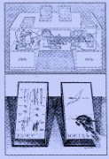

Ce site s'inscrit dans un projet à plusieurs entrées.

Ici s'écrit, entre autres, un livre. C'est l'archive vivante d'un projet d'écriture en cours, la face publique d'un autre projet né il y a deux ans, après la découverte fortuite des jardins numériques.

J'ai été touché et enthousiasmé par cette démarche, et par la volonté toujours présente de certains de faire d'Internet un lieu de partage de savoir, rester fidèle, en cela, aux pionniers du numérique, et notamment à la vision de [Vannevar Bush]{.mark-link} et de son Memex.^[Vannevar Bush, *As We May Think*, The Atlantic Monthly, 1945.]

::: {.column-margin}

**RÉFÉRENCE · MEMEX**
{width=150}

*Le memex est un ordinateur analogique fictif décrit par Vannevar Bush dans* As We May Think *(1945). Le nom est la contraction de* memory extender *— « gonfleur de mémoire ». Premier rêve d'une machine à penser et à relier les savoirs.*

[→ Lire l'article original](https://www.theatlantic.com/magazine/archive/1945/07/as-we-may-think/303881/)

:::

C'est Mike Caulfield qui, en 2015, a formulé le plus clairement cette distinction dans [*The Garden and the Stream: A Technopastoral*](https://hapgood.us/2015/10/17/the-garden-and-the-stream-a-technopastoral/) :

> *Le Jardin est le web comme topologie. Le web comme espace. C'est le web intégratif, le web itératif, le web comme arrangement et réarrangement des choses les unes par rapport aux autres. Chaque promenade dans le jardin crée de nouveaux chemins, de nouveaux sens.*

Ce projet d'écriture est ma modeste contribution à cette aventure utopique des savoirs. Celle qui me fait encore rêver aujourd'hui, même si elle est incommensurablement anonyme. À l'exact opposé des aventures extra-terrestres, qui ambitionnent d'autres planètes, celle-ci subsiste par hébergement précaire, de proche en proche. J'aime à croire, qu'elle est profondément en accord avec l'utopie de F.M. Alexander qui défendait une pensée de l'enseignement qui pourrait être accessible, ouverte, et révolutionnaire.

---

### Trois lieux numériques

Ce projet s'articule autour de trois espaces. 
Le contenu qu'il convoque est on ne peut plus pratique et repose avant tout sur une pratique de la présence. Ces espaces ne remplaceront pas une pédagogie incarnée, mais d'expérience, certains textes m'ont ouvert de façon radicale à des intuitions pratiques que je ne renierais pour rien au monde. J'ai pour leurs auteurs une reconnaissance infinie. Ils m'accompagnent avec une constance indéfectible depuis des dizaines d'années. J'espère secrètement, et bien modestement, que ces objets numériques puissent faire à leur façon et à leur échelle, de même.

[**Ce site**]{.mark-concept} est l'espace où le livre s'écrit, à l'abri d'un autre espace plus ensauvagé.

::: {.column-margin}

**ESPACE · LIVRE**

Le livre en construction, chapitre après chapitre. Écriture appliquée, progressive, publique.

*Vous êtes ici.*

:::

[**Garden Gester**](https://garden-gester.fr){.mark-link} est ce jardin numérique — plus rapide, moins appliqué, plus libre. Des notes, des fragments, des connexions inattendues. C'est là que les idées germent avant d'entrer dans le livre. C'est aussi là que paraît un journal de bord de la rédaction de celui-ci ; les questions en cours, les impasses, les trouvailles. Cette aventure pourrait peut-être intéresser d'autres personnes qui écrivent, ou veulent le faire, et qui, comme moi, ne sont pas particulièrement confiantes dans leur capacité à réaliser à bien ce projet.

::: {.column-margin}

**ESPACE · JARDIN**

[{width=100}](https://garden-gester.fr)

Le jardin numérique — plus ensauvagé, plus libre. Notes, fragments, connexions inattendues. Le journal de bord de l'écriture y paraît régulièrement.

[→ Visiter Garden Gester](https://garden-gester.fr)

:::

**Ko-fi** est l'espace du soutien, si et seulement si cela fait sens pour vous.

---

### Contribuer

Vous pouvez vous promener ici, dans les travaux, sans casque ni chaussure, et dans le Garden Gester comme bon vous semble — cueillez autant de fruits que vous voulez. Et si, seulement si cela vous nourrit, vous avez la possibilité numérique de contribuer : 4€ une fois pour toutes, ou tous les mois, ou de temps en temps.

---

### Télécharger le livre

Ce site génère automatiquement une version epub du livre à chaque mise à jour. C'est l'état du livre aujourd'hui.

[📖 Télécharger l'epub](Pour-une-pédagogie-perceptive.epub){.btn .btn-primary}

---

> *Le Jardin est le web comme topologie. Le web comme espace. C'est le web intégratif, le web itératif, le web comme arrangement et réarrangement des choses les unes par rapport aux autres. Chaque promenade dans le jardin crée de nouveaux chemins, de nouveaux sens, et quand on y ajoute des choses, on les ajoute de façon à permettre des relations futures, imprévisibles.*
>
> Mike Caulfield, *The Garden and the Stream: A Technopastoral*, 2015